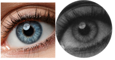
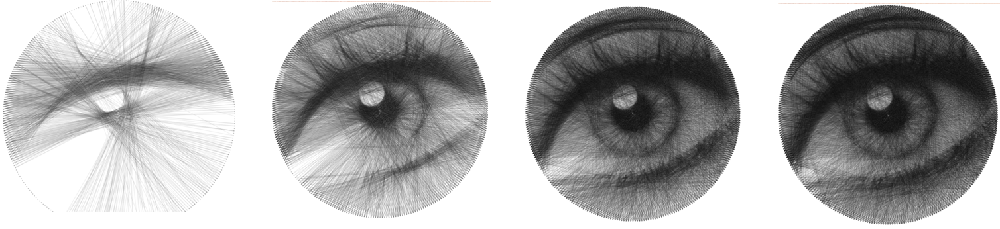

# String Art

A small personal project that aims to recreate an input image with a continuous length of string. This project was inspired by the art of Petros Vrellis and inplements the algorithm outlined by the following paper: https://doi.org/10.1111/cgf.13359. 

This was a small weekend project, so the codebase is in serious need of a complete rework (but I still think the concept is worth displaying :)).

## Dependencies
- Flask 
- Python

